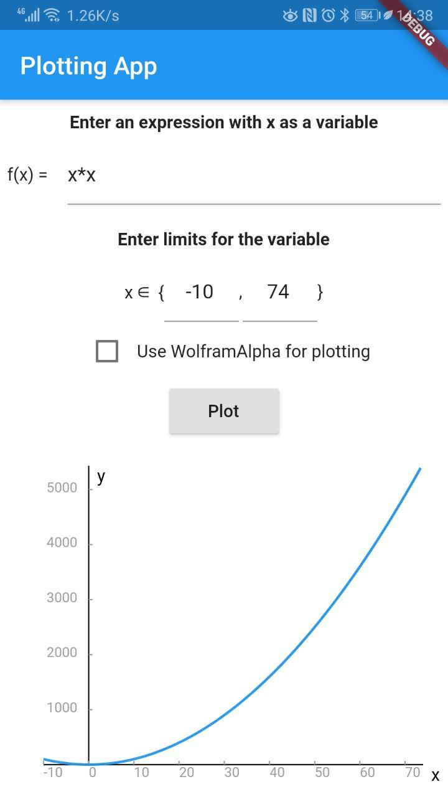
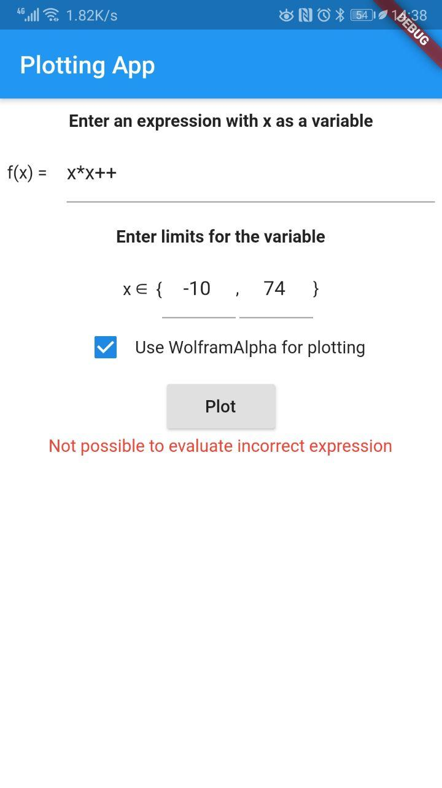
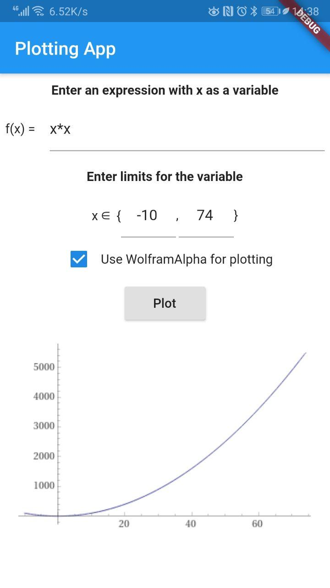

# plotting_app

Flutter Plotting App

## Description

The app plots functions that user can write in the form.

Supported operations: +, -, unary -, *, /, (, ),  ^, sqrt

It is mandatory to set limits for *x* variable.

###  Examples of the app work:

## How to run

1. Please add your WolframAlpha API key to the [lib/secrets.dart](lib/secrets.dart)
2. Run as usual flutter app

Or try by downloading [apk file](https://drive.google.com/file/d/19qqWivqjM1y0YZ-jwVg-sCAl5C1-Ja5X/view?usp=sharing);